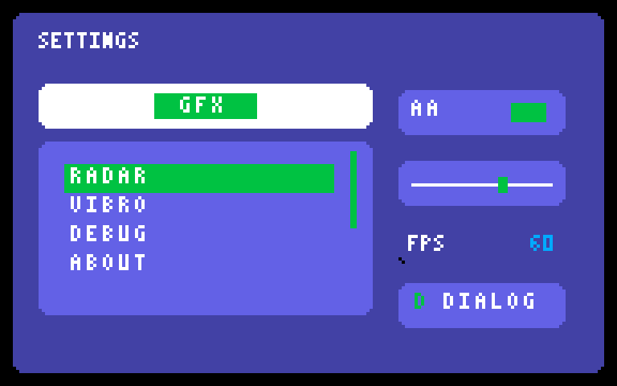
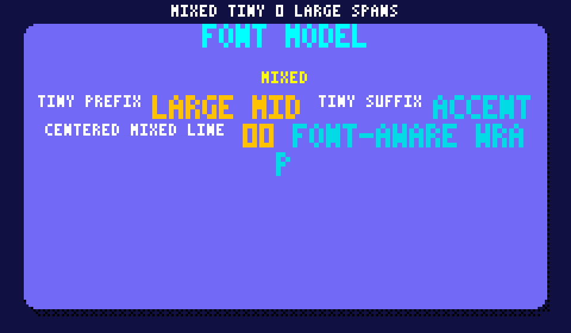

# embedded-gui

`embedded-gui` is a `no_std` GUI/HUD crate for `embedded-graphics` displays.
It is built around fixed-capacity data structures, deterministic rendering, and
embedded-friendly interaction patterns (pointer, encoder, and keyboard-style input).

## Current State

`embedded-gui` currently provides a broad baseline of widgets, interaction semantics,
fixed-capacity animation primitives, and screen transition tooling for embedded UIs.
Recent work has focused on tightening interaction fidelity, expanding state transition
coverage, and improving regression-focused examples/docs.

- Pointer release semantics now consistently target the originally pressed widget.
- Focused open dropdowns now close on `Back` before global back handling.
- State transitions now cover keyboard and pointer press feedback paths.
- Enabled/disabled flag changes now participate in state transitions with regression coverage.
- Style-class state overrides now participate correctly in transition endpoint blending.
- Select activation now supports configurable double-select recognition (`DoubleClicked` events).
- Per-widget raw key input policy now supports `SelectPressed/Released` and `BackPressed/Released`.
- Pointer interaction now supports configurable double-click recognition (`DoubleClicked` events).
- Per-widget key bindings can override `Select`/`Back` behavior (`Default`, `Ignore`, `Activate`, `Back`).
- Textarea no-op edits avoid emitting mutation events, with regression coverage.
- Wrapped-line selection navigation (`SelectHome`/`SelectEnd`) now has dedicated edge-case coverage.
- Cross-widget interaction matrix coverage now includes dropdown/list/tabs/roller keyboard navigation paths.
- Nested layout + clip behavior now has dedicated regression coverage for parent-relative composition.
- A dedicated interaction semantics simulator example is available in `examples/interaction_semantics_showcase.rs`.

## Quick Start

```rust
use embedded_gui::prelude::*;

let mut gui = GuiContext::<8, 4, 8>::new(Rect::new(0, 0, 128, 64));
gui.add_label(Rect::new(4, 4, 80, 8), "READY", Style::label())?;
gui.add_progress_bar(Rect::new(4, 18, 80, 8), 0.6, Style::progress())?;
gui.render(&mut display)?;
```

## Implemented Feature Surface

### Widgets and primitives

The current widget set includes:

- labels, panels, buttons, icon buttons, borders/spacers
- progress bars, sliders, toggles, checkboxes, value labels
- lists, menus, tabs, dialogs, toasts, scroll views
- dropdowns, rollers, tables
- chart (line and bars), spinner, meter/gauge/arc gauge/needle
- textareas and on-screen keyboards
- image widgets (`ImageRef`, `ImageFit`, atlas/sprite helpers)

### Input and events

- `InputEvent` supports D-pad/encoder navigation, pointer events, and text-editing-oriented key events
- UI-level events (`UiEvent`) and widget-level events (`WidgetEvent`) are both exposed
- Event flow supports capture, target, and bubble phases with filterable dispatch policy hooks
- Pointer semantics include long-press, gesture dispatch, drag scrolling, inertia, and press-repeat timing hooks

### Layout, styling, and text

- `LinearLayout` and constraint-based item layout (`Length`, `Min/Max`, `Percent`, `Ratio`, `Fill`)
- Style model with stateful variants (`normal`, `focused`, `pressed`, `disabled`)
- Style interpolation and transition primitives (`StyleTransition`, `lerp_style`)
- Text layout primitives (`Span`, `Line`, `Text`) with alignment, wrapping, spacing, overflow controls
- Text shaping interface (`TextShaper`) with a basic shaping implementation for embedded-safe defaults

### Animation and transitions

- Core animation manager and easing/tween/path/spring/inertia primitives
- Widget property animation (`WidgetAnimator`) and preset helpers (`presets`)
- Timeline/keyframe sequencing support (`AnimationSequence`, `SequencePlayer`)
- Screen stack + transition primitives for app-level flows

## Animation Quickstart

`embedded-gui` includes fixed-capacity animation primitives that stay `no_std` friendly.

```rust
use embedded_gui::prelude::*;

let mut animator = WidgetAnimator::<8, 8>::new();
let progress = gui.add_progress_bar(Rect::new(4, 18, 80, 8), 0.0, Style::progress())?;
animator.animate_progress(progress, 0.0, 1.0, 600, Easing::InOutSine)?;

// In your frame loop:
animator.tick(16, &mut gui)?;
gui.render_dirty(&mut display)?;
gui.clear_dirty();
```

## Textarea Editing Input

Textarea widgets support editor-style navigation and mutation events, including:

- `InputEvent::WordLeft` / `InputEvent::WordRight`
- `InputEvent::Home` / `InputEvent::End`
- `InputEvent::Select*` expansion variants
- `InputEvent::Undo` / `InputEvent::Redo`
- selection-replace behavior on typing/backspace/delete

See `docs/textarea-input-keybindings.md` for mappings and loop snippets.

## Font Glyph Overrides

The build pipeline supports external glyph overrides from:

- `assets/fonts/ascii_3x5.txt`
- `assets/fonts/ascii_4x7.txt`

Format per line:

```text
key:row0,row1,row2,row3,row4
```

- `key`: a single character or `space`
- each row: 3 bits using `0`/`1` (left to right)
- blank lines and `#` comments are ignored

Example:

```text
?:111,001,010,000,010
!:010,010,010,000,010
space:000,000,000,000,000
```

Unspecified glyphs fall back to built-in defaults in `build.rs`.

Preview helper:

```bash
python3 scripts/preview_glyphs.py assets/fonts/ascii_3x5.txt "?!@"
```

## Examples

The `examples/` folder currently includes:

- `widgets_showcase.rs`
- `dashboard_app.rs`
- `simulator_menu.rs`
- `event_dispatch_showcase.rs`
- `interaction_semantics_showcase.rs`
- `raw_key_input_showcase.rs`
- `form_flow_showcase.rs`
- `complex_layout_showcase.rs`
- `input_gesture_drag_repeat_showcase.rs`
- `long_press_input_showcase.rs`
- `text_layout_showcase.rs`
- `font_text_model_showcase.rs`
- `animation_motion_showcase.rs`
- `animation_kitchen_sink_showcase.rs`
- `animation_dirty_showcase.rs`
- `timeline_transition_showcase.rs`
- `visual_quality_showcase.rs`
- `embedded_3dgfx_overlay.rs`

## Behavior Notes

- Input and widget interaction guarantees are documented in `docs/interaction-behavior-contract.md`.

## Example Screenshots

Dashboard-style UI:



Mixed font text model showcase:



