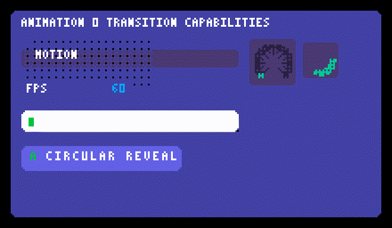
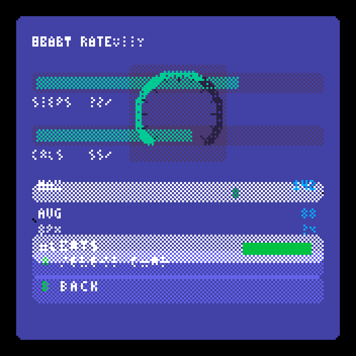
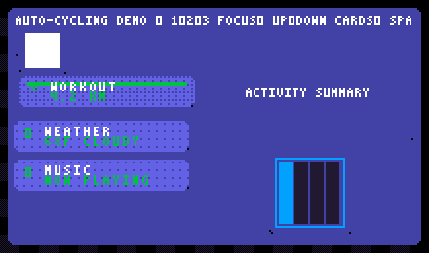
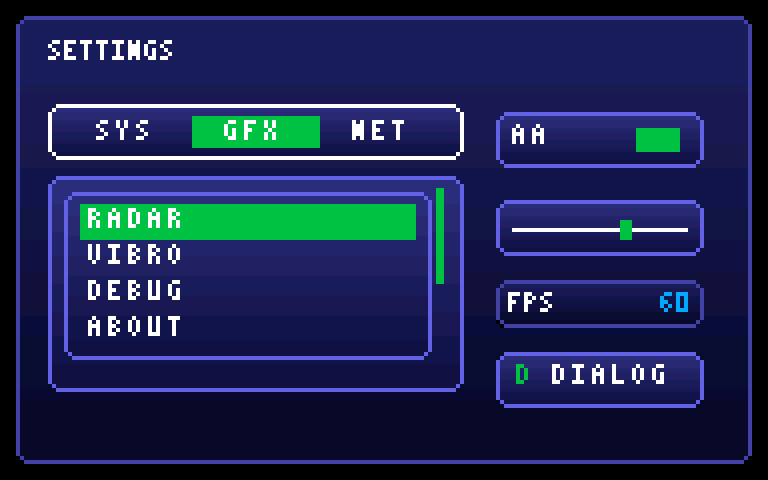
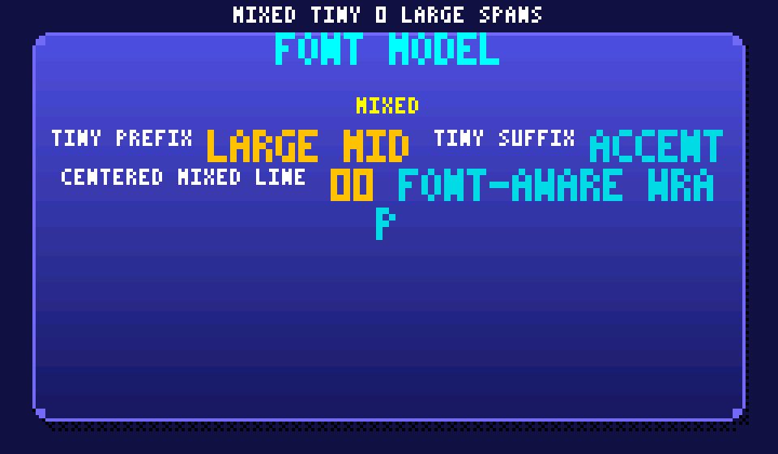

# embedded-gui

[](https://crates.io/crates/embedded-gui)
[](https://docs.rs/embedded-gui)
[](https://github.com/leftger/embedded-gui/actions/workflows/ci.yml)
[](LICENSE-MIT)

`embedded-gui` is a lightweight, deterministic, zero-allocation (`no_std`) GUI & HUD framework for microcontrollers and [`embedded-graphics`](https://crates.io/crates/embedded-graphics) displays.

Heavily inspired by the **Pebble** smartwatch UI framework—its animation model, interaction contracts, and cinematic motion primitives draw directly from Pebble's design language. **LVGL** serves as a secondary influence for widget composition, layout rules, and state-variant styling.

---

## Key Capabilities

- 🧱 **Zero-Allocation (`no_std`)**: Built entirely on fixed-capacity data structures (`heapless`) with strict memory bounds and deterministic execution times.
- 🧩 **Rich Built-in Widgets**: Buttons, Sliders, Dropdowns, Toggles, Checkboxes, Gauges, Meters, Sweeping Arcs, Plotters/Charts, TextAreas, On-Screen Keyboards, and Circular Lists.
- 🛠️ **Native Custom Widgets**: Extensible third-party widget support via type-erased `WidgetStorage<'a>` and object-safe `Widget` trait contracts.
- 🎬 **Unified Motion Engine**: Pebble-inspired spatial easing curves (`moook`), spring dynamics, timeline keyframing, property mutator bindings, and screen stack transitions (flip-card, peek/glance, shutter, portal).
- 🎨 **Decoupled Rendering Engine**: Bounding-box dirty tracking, opacity layering, software IIR blur, subpixel anti-aliasing, and custom display backends.
- ⚡ **Async DMA & Double/Triple Buffering**: Zero-copy presentation via `CompletionSlot` and `StandardSwapChain`, fully compatible with Embassy `async/await` or bare-metal superloop polling.
- 🎯 **Multi-Target Tested**: Continuously verified across ARM Cortex-M0/M0+ (`thumbv6m`), Cortex-M4F/M7F (`thumbv7em`), Cortex-M33/M55 (`thumbv8m.main`), and RISC-V (`riscv32imac`).

---

## Quick Start

```rust
use embedded_graphics::pixelcolor::Rgb565;
use embedded_gui::prelude::*;

// 1. Create a fixed-capacity GUI context (Max Widgets, Focus Group Capacity, Dirty Rects)
let mut gui = GuiContext::<16, 4, 8>::new(Rect::new(0, 0, 320, 240));

// 2. Spawn widgets using the fluent builder pattern
let status_label = gui.spawn(
    WidgetBuilder::new(Rect::new(10, 10, 150, 20))
        .with_style_class("header")
        .build()
)?;

// 3. Mutate properties dynamically using the generic property engine
gui.set_widget_property(status_label, PropertyKey::Text, PropertyValue::Text("SYSTEM OK"))?;

// 4. Render only dirty regions to your embedded-graphics DrawTarget
gui.render(&mut display)?;
```

---

## Visual Showcase

### Pebble-style Cinematic Motion & Transitions


### Flip-card Screen Stack Transitions


### Launcher Glance Tiles & Card Story Deck


### Dashboard UI Composition


### Mixed Typography & Font Models


---

## Feature Architecture

### 1. Widgets & Layouts
- **Controls**: Buttons, Icon Buttons, Sliders, Toggles, Checkboxes, Dropdowns, Rollers.
- **Data & Display**: Progress Bars, Gauges, Meters, Sweeping Arcs, Plotters/Line Charts, Bar Charts, Busy Wheels.
- **Structure & Layout**: Linear Layouts (Row/Column with spacing & constraints), Panels, Tabs, Cards, Dialogs, Circular Lists.
- **Input & Text**: TextAreas (word wrap, selection, undo/redo), On-Screen Keyboards.

### 2. Motion Framework (`src/motion/`)
- **Easing & Physics**: Standard Easings (Linear, Quad, Cubic, Sine, Exponential) + Pebble Spatial Easing (`moook_curve`), Spring Physics, Inertia.
- **Timelines & Keyframes**: Multi-track property keyframing and sequence controllers.
- **Screen Stack Transitions**: Slide, Fade, Portal, Shutter, Modal Overlay, Round-Flip Card.

### 3. Render Engine (`src/render/`)
- **Dirty Region Tracking**: Merges overlapping invalidate rectangles to minimize SPI/I2C/Parallel bus transfers.
- **Compositing**: Software alpha blending, opacity stacks, subpixel anti-aliasing, and IIR blur filters (RGB565, RGBA8888, GRAY8).

### 4. Input & Semantics (`src/input/`)
- Multi-device event mapping: Rotary Encoders (CW/CCW/Press), D-Pad/Keyboards (Arrow keys, Select, Back), Touch/Pointer (Tap, Long Press, Drag, Flick).
- Configurable per-widget focus navigation, raw key policies, and event routing phases (Capture, Target, Bubble).

---

## Examples Directory

The repository includes showcase examples categorized under `examples/`:

| Directory | Purpose & Highlights |
|-----------|----------------------|
| **`examples/basics/`** | Core layout rules, dashboard layout, form flows, interaction semantics, raw key input, and keyboard navigation (`dashboard_app.rs`, `complex_layout_showcase.rs`, `form_flow_showcase.rs`). |
| **`examples/widgets/`** | Comprehensive widget showcases, gauges, sweeping arcs, alpha blending, and visual quality benchmarks (`widgets_showcase.rs`, `visual_quality_showcase.rs`, `sweeping_arc_widget_showcase.rs`). |
| **`examples/motion/`** | Motion framework, Pebble-style spring physics, dirty-region animation, timeline keyframing, and cinematic peek/glance cards (`animation_motion_showcase.rs`, `cinematic_peek_glance_carddeck_showcase.rs`). |
| **`examples/integrations/`** | Third-party interop, Embassy async frames, DMA swapchain simulation, and 3D graphics overlays (`embassy_gui_frame.rs`, `completion_swapchain_sim.rs`, `embedded_3dgfx_overlay.rs`). |

Run any example using Cargo:
```bash
cargo run --example dashboard_app --features std
cargo run --example animation_motion_showcase --features std
```

---

## Cargo Features

| Feature | Description |
|---------|-------------|
| `embedded-graphics` | *(Default)* Transparent support for `embedded-graphics` `MonoFont` references (`&FONT_6X10`, `&FONT_9X15`) in styles and text rendering. |
| `libm` | Provides floating-point math support (`f32::sin`, `cos`, `round`, `sqrt`) when building for `no_std` targets without standard library floats. |
| `rich-widgets` | Enables advanced visual widgets including Gauges, Plotters, TextAreas, and On-Screen Keyboards. |
| `embedded-text` | Enables interoperability adapters for `embedded-text` `TextBox`. |
| `embedded-layout` | Enables interoperability adapters for `embedded-layout` `View` alignment. |
| `embassy` | Adds `EmbassyWaitTransfer` and `FrameClock` for Embassy async executor integration. |
| `triple-buffering` | Enables triple-buffer swapchain for bursty display frame rates. |

---

## License

Dual-licensed under either of:

- **MIT License** ([`LICENSE-MIT`](./LICENSE-MIT))
- **Apache License, Version 2.0** ([`LICENSE-APACHE`](./LICENSE-APACHE))

at your option.
