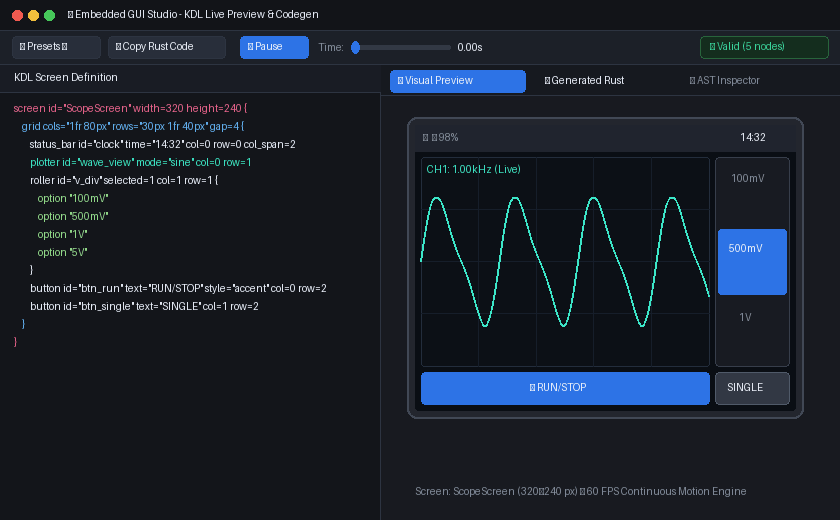

# Embedded GUI Studio

A cross-platform desktop & web GUI studio for declarative KDL GUI editing, 60 FPS live animation preview, and `#![no_std]` Rust code generation for `embedded-gui`.

<div align="center">
  
</div>

## Features

- **Live KDL Editor**: Write declarative GUI screens in KDL with real-time parser validation and inline error diagnostics.
- **🖥 Pixel-Faithful Preview**: The canvas displays the RGB565 framebuffer rendered by the actual `embedded-gui` `GuiContext` and sent over USB. Nearest-neighbor 1x, 1.5x, and 2x zoom preserves display pixels, while selection boxes, grid dividers, and resize handles remain editor-only overlays.
- **⏱ Animation Controls**: Live playback, reset, and timeline controls for transitions and widgets supported by the real framebuffer renderer.
- **🦀 Generated Rust**: Instant, zero-allocation `#![no_std]` Rust code generator preview with one-click clipboard copy.
- **🌲 AST Inspector**: Structured view of screen metrics, grid tracks, and placed widget hierarchy.
- **Starter Presets**: Built-in starter templates (Oscilloscope, Motion Kitchen Sink, Smart Thermostat, Sensor Dashboard, SSD1357 96×64).
- **📁 KDL Projects**: Open/save a multi-screen project directory (`project.kdl` + `screens/*.kdl`) for firmware check-in; see [`docs/kdl-projects.md`](../../docs/kdl-projects.md).
- **🖥 USB Live Display**: Stream the rendered screen to real hardware over native USB-HS bulk. Studio renders the screen through the actual `embedded-gui` `GuiContext` into an RGB565 framebuffer, diffs it, and pushes only changed tiles to a flashed display agent — the board updates in real time as you edit, with no reflash.

## Running Locally

To launch the studio GUI:

```bash
cargo run -p embedded-gui-studio
```

## Live streaming to hardware (USB-HS bulk)

The live path uses the [`embedded-gui-live`](../embedded-gui-live) protocol: a compact, length-prefixed binary framing (resync magic + CRC-16) carrying RGB565 frame rectangles, decodable on the MCU with constant RAM.

Studio scans for display agents at launch. If exactly one is attached it connects automatically, and once the agent reports its panel size the **Target** switches to `Connected Display (WxH)` and the active screen is resized to match — so a freshly launched Studio already renders at the board's native resolution. With several agents attached the choice is left to you in the picker below.

1. Flash a display agent on the board that speaks the protocol and blits rectangles to its panel. A reference agent for the STM32WBA65 + ILI9341 lives in [`stm32wba-tftdisplay`](../../../stm32wba-tftdisplay) (`studio_agent` bin) and enumerates as a vendor-specific interface with 512-byte bulk IN/OUT endpoints. Windows binds WinUSB through its MS OS 2.0 descriptors; Studio uses `nusb` directly on all hosts.
2. Connect the board's USB device port to the PC.
3. In Studio's top bar, pick the USB display agent next to **Connect USB** and click **Connect**. Studio claims interface 0, discovers its bulk endpoints, sends a `Hello`, and waits for `Ready { fb_w, fb_h, max_rect_bytes }`.
4. Edit KDL with **Live** checked and the panel updates on every change (first frame is a full repaint, subsequent frames send only changed 40x40 tiles). **Push Frame** bypasses the diff and repaints every tile, which resyncs a panel that has drifted from the host's baseline.

Notes:
- The agent reports its panel size in `Ready`, and Studio fits every frame to it: a larger screen is centered and cropped, a smaller one is letterboxed onto the theme background. A size mismatch is called out next to the **Live** checkbox, since the board cannot show pixels outside its panel — match the screen's `width`/`height` to the panel to use the full display.
- The **Target** selector is authoritative: an auto-detected panel or a profile with fixed dimensions resizes the active screen, and every screen load re-applies it — screen tabs, the **Presets** menu, and opening a `.kdl` file — so a screen authored for another panel does not silently change the canvas size. Choose **Custom Screen** to let each screen keep its own declared `width`/`height`.
- Any edit reaches the board while **Live** is checked, including canvas drags, inspector changes, screen switches, and theme swaps. While playback is running, inherently animated framebuffer widgets (currently active busy wheels and plotters) are rendered and submitted at up to 30 FPS; the latest-frame slot drops stale intermediate work if the panel falls behind. **Push Frame** is only needed to force a resync.
- Streamed colors follow the selected **Theme**: KDL style tokens (`accent`, `success`, `danger`, `inverted`, `card`, `bold`) resolve against the same palette the canvas draws with, converted to RGB565. Changing the theme while **Live** is checked repaints the board.
- The canvas and USB transport consume the same RGB565 render path. In Interactive mode (where editor overlays are hidden), the canvas represents the exact pixels submitted to the display agent.
- Every `WidgetDef` variant is rendered: core controls go through `GuiContext`, while status bars, pickers, indicators, busy wheels, and vector/shape primitives are painted via `RenderCtx` into the same framebuffer. Plotters use a host-generated demo waveform when KDL only specifies a mode.
- The transport uses a vendor class (`0xFF`) with 512-byte native bulk endpoints, 1024-byte OUT buffering, and direct host USB access rather than a virtual COM port. The reference WBA65 agent pipelines decoded tiles through a two-slot queue to a dedicated GPDMA SPI task, so USB can receive the next tile while the current tile is clocked into the ILI9341. The SPI panel refresh remains the limiting factor, not USB.
- Compact targets such as **SSD1357 (96×64)** letterbox onto a larger agent panel while you keep editing at native OLED size — see [`docs/kdl-projects.md`](../../docs/kdl-projects.md).
- On-glass widget interaction (touch) is supported when the agent uplinks `Touch` samples; Live Interactive injects them into the same hit-testing path as the mouse.
